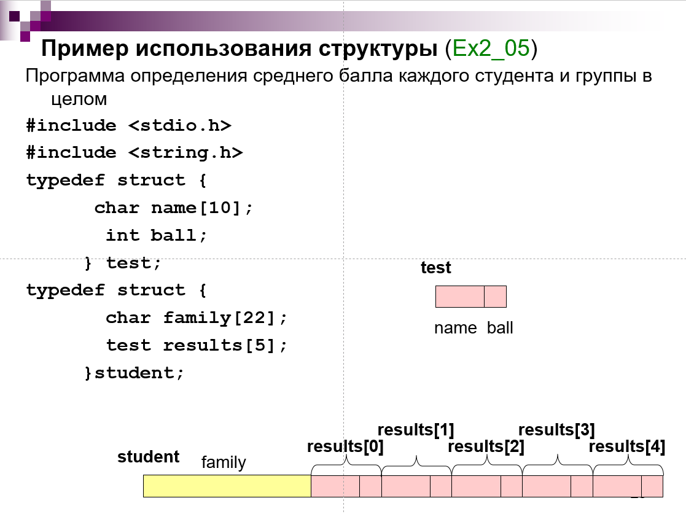
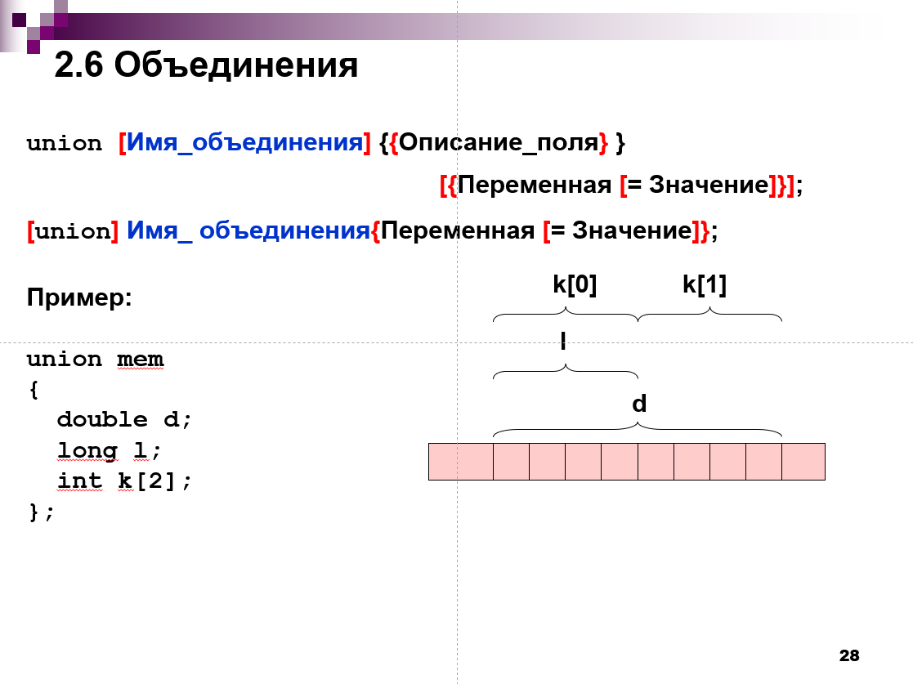
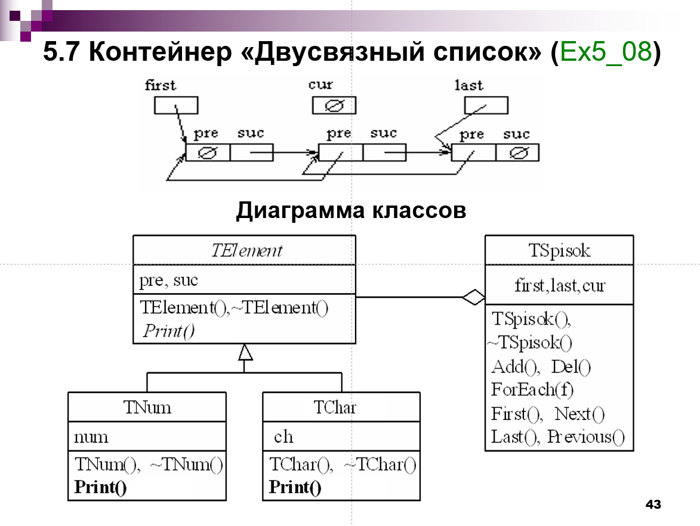
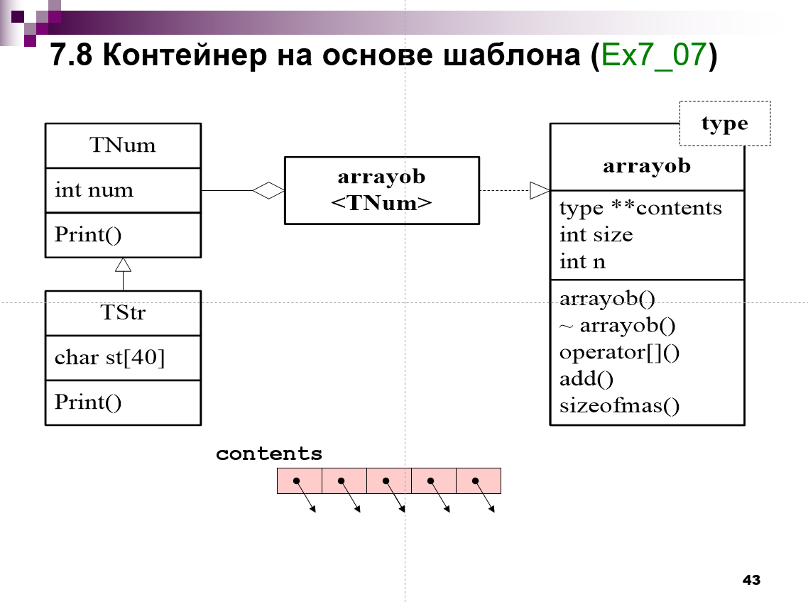
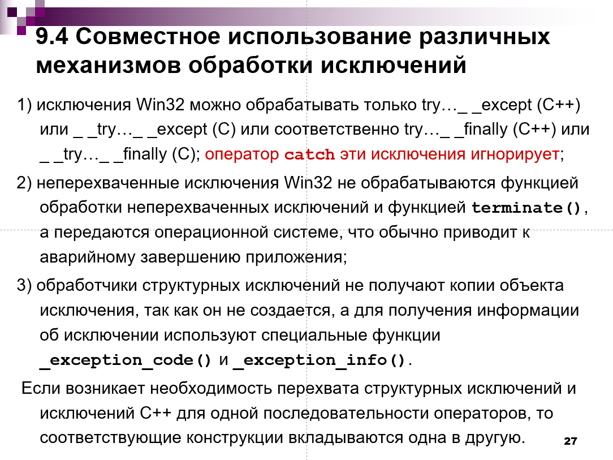

## 1. Структура программы на С++. Пример простейшей программы. Препроцессор

Программа на С++ складывается из команд препроцессора,блока объявления типов и констант, 
блока описания функций, основной функции, называемой main()

Препроцессор - компьютерная программа, которая удаляет из кода комментарии, преобразует код в соответствии с макросами и выполняет иные директивы, начинающиеся с символа `#` (такие как `#include`, `#define`, разнообразные директивы типа `#pragma`, `#ifndef`).

Структура консольной программы по Ивановой:
```
{команды_препроцессора}
[объявление_типов,_констант,_переменных]
{прототип функции}
{функция}
функция main()
{функция}
```
где `[]`, `{}` - часть расширенной формы Бэкуса-Наура [(приложение А)](#приложение-а-расширенная-форма-бэкуса-наура).

Пример программы на C++:

```c++
//блок команд препроцессора
#include <iostream> 
#define C = 10 // c-style константа

// Импорт всех имён из постранства имён std
using namespace std; // не является командой препроцессора

//блок объявления типов и констант, переменных
typedef struct FooBar {
    int a;
    double b;
} FooBar;
constexpr int bar = 10; // c++-style константа. constexpr означает, что значение переменной будет обязательно вычисленно во время компиляции. С const такой гарантии нет: значение может вычисляться и в рантайме. Не помню, говорила ли Иванова об этом.
int baz = 42;
class FooBaz {
    void * smth;  
};
typedef enum BarBaz { a, b, c } BarBaz;

//прототип функции
void foo();

//основная функция main()
int main() {
    foo();
    return 0;
}

//блок объявления и описания функций
void foo() { cout<<"Hello World!" }
```

Наипростейшая программа на C++:

```c++
int main() { return 0; }
```

## 2. Скалярные типы данных С++. Определение констант и переменных. Примеры определений

A: Целочисленные типы


Б: Вещественные типы данных


В: Неопределенный («пустой») тип void.

Г: Перечисляемый тип

```c++
enum {SUN, MON, TUES, FRI=5, SAT} day;
//SUN =0, MON = 1, TUES = 2, FRI=5, SAT=6

// или же
enum class Options { None, One, All }; // использование слова class ограничивает область видимостии перечесляемых значений (C++11), нужно пользоваться обязательно операцией доступа `::`
Options o = Options::All;
```

Для совместимости с Си при приведении числа к bool считается, что false - 0, true - любое число кроме 0.

## 3. Операции над скалярными данными С++. Приоритеты операций. Примеры выражений

А: Арифметические операции

```c++
int a=5;
int b=3;
int c;
c=a+b; //8 -сложение
c=b-a; //2 - вычитание
c=a*b; //15 -умножение
c=a/b; //1 (если оба числа int то результат int, если один не int то результат float (или double, смотреть в стандарт :) ))
c=a%b; //2 - остаток от деления
```

Б: Логические операции

```c++
bool a=true;
bool b=false;
bool c=false;
bool d=(((a)&&(!b))||(c)) //true
```

<br>В: Логические поразрядные - аналогично логическим, только операции выполняются над числами в их двоичном представлении</br>
<br>Г: Обычные операции сравнения (<, >, >=, <=, ==, !=)</br>
<br>Д: Сдвиговые операции </br>

```c++
unsigned int a = 2 << 2;          // 10  на два разрядов влево = 1000 - 8
unsigned int b = 16 >> 3;         // 10000 на три разряда вправо = 10 - 2
```

<br>E: Порядковые операции </br>

```c++
int a=2;
int d= a++ ; // d=2 a=3
int c= ++a ; // d=3 a=3
```

<br>Ж: Операции присваивания</br>

```
*=, +=, -=, /=, =, %=, &=, |=, ^=, <<=, >>=
```

<br>З: Тернарный оператор</br>

```c++
int a=2;
a==2? cout<<"Da" : cout<<"No"; //Da
```

<br>Приоритет оперций в С++ такой:</br>

```
1.  ( )   [ ]   ->  ::   .
2.  ! (не)  +  -  ++  --  &(переменная)  *(указатель)  sizeof  new  delete
3.  .*   ->*
4.  *   /   %
5.  +  - (бинарные)
6.   <<   >>
7.   <   <=   >   >=
8.   = =   ! =
9.   &(поразрядное и)
10.  ^(исключающее или)
11.  | (поразрядное или)
12.  &&
13.  ||
14.  ?:
15.   =   *=   /=   %=   +=   -=   &=   ^=   |=   <<=   >>=
16.  ,
```

## 4. Управляющие операторы if и switch С++. Примеры

Сказать нечего, лучше привести пример)

```c++
//пример условной операции 
if(a>b) coat<<a;
else cout<<b;
```

```c++
//пример операции switch
switch (n) {
    case 1:
        printf("Hello");
        break;
    case 2:
        printf("World!");
        break;
    default:
        printf("Saucesamba"); //выбор по умолчанию
        break;
}
```

## 5. Организация циклов в С++. Примеры

```c++
// Цикл перебора:
int k=0;
for(int i = 0; i < 5; ++i /* от авторов, рекомендуется именно такой оператор инкремента */) {
    k += i;
}
```

```c++
// Цикл while(пока):
int k = 0;
while (k < 5) {
    k++;
}
```

```c++
// Цикл do-while:
int k = 6;
do{
k--;
}while(k > 0)

// Цикл range-based-for или for по коллекции. Работает над стандартными контейнерами и массивами
for ((описание_переменной) (имя_переменной) : (имя_контейнера)) {}

vector<int> vec = {1, 2, 3};
for (const auto & num : vec) {
    cout << num;
} // 123
```

Подробнее об `const auto &` в [приложении Б](#приложение-б-синтаксис-работы-с-переменными). 

## 6. Неструктурные операторы передачи управления в С++

```c++
if (!b){
goto exit; 
}
else{
     /*...*/ 
}
exit: c="Error";
//если не, то все строки когда проигнорируются, и компилятор перейдёт к строке с меткой exit
```

```c++
while ( i < 5 )
{
    cin >> x;
    if ( x >7 ){
        cout<<"Too big number";
        continue;
    }
    y += x * x;
}
//В данном примере при x>7 будет проигнорировано все что стоит после оператора continue, и будет осуществлен переход к следующей итерации цикла
```

```c++
for(int i=0; i<n; i++)
{
    cin>>x;
    if ( x >15 )
         break;
    else y += x * x;
}
//при х>15 цикл аварийно завершится
```

## 7. Указатели и ссылки. Примеры объявлений

<br>
Указатель- переменная, в которой хранится адресс ячейки памяти (первого байта этого куска памяти).
</br>

<br>
Ссылка тоже физически представляет собой адрес, но в отличие от указателя при работе со ссылками не используется операция разыменования.
Можно сказать, что ссылки - это “псевдонимы” переменных, которые используются для работы с ними.
</br>

```c++
$ Указатель = [изменяемость_значения] Тип [изменяемость_адреса] * Имя [=Адрес]

void * a; // изменяемой адрес и данные
const int * b = new int(1); // неизменяемое значение, изменяемый указатель
int * const c = new int(2); // изменяемое значение, неизменяемый указатель
```

Простое мнемоническое правило: если `const` стоит до `*`, то относится к данным, если после -- к указателю.

Примеры:

```c++
int a,*ptri,*ptrj; 
void *b;
ptri = &a; // записали в указатель ссылку на а     
ptri = nullptr; // нулевой указатель
ptri = ptrj; // присваивание указателей
b = &a; // неявное преобразование указателя на int к указателю без типа
// явное преобразование типа указателя
ptri = (int *) b; // c-style
ptri = static_cast<int *> b; // cpp-style
// разыменование указателя
int c, a = 5, *ptri = &a;  
c = *ptri; 
*ptri=125;
```

## 8. Управление динамической памятью С++. Примеры

c++-style: 
`new (тип)` - операция выделения памяти  
`delete (типизированныйуказатель)` - операция освобождения памяти из-под объекта  
`delete[] (типизированный указатель)` - операция  освобождения памяти из-под массива  

c-style:  
`void * malloc(size_t size)` - выделение куска памяти  
`void * calloc(size_t n, size_t size)` - тоже выделение куска памяти, можно использовать для создания массивов.  
`free (void * ptr)` - освобождение куска памяти

*Если невозможно выделить указанное число байт, то операции/функции возвращают **нулевой** указатель.*

```c++
int *k;
k = new int; //операция выделения памяти
*k = 85;

int *a;   
if ((a = new int(-244)) == NULL){ 
    printf("Not enough memory.");
    exit(1);  
} 
delete a; //операция освобождения памяти

//пример со списком
int *list;   
list = new int [3]; //выделение памяти сразу на 3 объекта типа int
*list=-244;
*(list+1)=15;   
*(list+2)=-45; 
delete[] list; 
```

## 9. Адресная арифметика С++. Примеры


```c++
int arr[] = {1, 2, 3, 4, 5};                    //создаем массив на несколько элементов
int* ptr = &arr[0];                             // получаем адрес первого элемента массива
cout << ”Первый элемент: ” << *ptr << endl;     // выводим первый элемент
ptr++;                                          // увеличиваем указатель на 1
cout << ”Второй элемент: ” << *ptr << endl;     // выводим второй элемент
ptr += 2;                                       // увеличиваем указатель на 2
cout << ”Четвертый элемент: ” << *ptr << endl;  // выводим четвертый элемент
```

## 10. Массивы С++. Примеры объявлений и две технологии обработки. Пример

Индексация массивов в С++ начинается с 0.

```c++
int mas[5]={1,2,3,4,5}; //заполнение массива при объявлении
int arr[100];  //массив
int mtr[3][5]; //матрица, в памяти строки расположены одна за другой
```

### Технологии обработки массива

<br> Обработка массива циклом foreach</br>

```c++
int arr[5] = {1, 2, 3, 4, 5}; 
for(int &x : arr) { //работа ведется непосредственно с элементами массива
    x*= 2; 
} 
for(auto x:arr)  //работа ведётся с копиями элементов, при этом слово auto говорит нам что тип элементов определяется автоматически.
    cout << x << ' '; 

for(const auto &x:arr) //слово const говорит о том, что значения нельзя изменять 
    cout << x << ' ';
```

<br> Обработка массива с помощью адресной ариметики</br>

```c++
int a[5] = {1, 2, 3, 4, 5};
int *list = a; // массивы можно приводить к указателям
(list+1) // ~ &list[1]
*(list+2) // ~ list[2]
```

## 11. Строки С++. Стандартные функции, работающие со строками. Примеры

Вообще говоря, в чистом Си понятие "строка" отсутствует, однако последовательность символом можно задать, используя `char`-массивы и соответственно указатели на `char`-массивы.

**Основное отличие** от паскалевых строк заключается в внутреннем представлении строк и контроле их длины. В паскале первый байт хранит в себе длину строки, в Си же хранение длины строки не происходит, вместо этого конец строки помечается специальным нулевым символом `\0`, поэтому сишные строки ещё называют "нуль-терменированными".

Для получения длины строки Си можно использовать функцию `size_t strlen(const char *)` 

Идиоматичным для c++ является использование специального класса `string` из пространства имён `std` из библиотеки `string`, который фактически является обёрткой над строкой Си и предоставляет некоторый набор операций над такой строкой. Будьте осторожны, использование `string` вместо сишных строк может триггернуть Иванову.

Примечание от Ивановой, пунктуация сохранена.  Цикл for по коллекции для строк использовать нельзя, поскольку он не видит завершающего нуля… 

Отсебятина от Залыгина. Не знаю, кто там что не видит, но сама конструкция `range-based for` (также именуемый Ивановой как `for по коллекции`) рассахаривается в обычный `for` по итератору от объекта [с некоторыми нетривиальными особенностями](https://en.cppreference.com/w/cpp/language/range-for). Не могу сказать, как связано примечание с внутренней реализацией такого цикла.

Про строковые литералы. [Строковые литералы](https://learn.microsoft.com/ru-ru/cpp/c-language/c-string-literals?view=msvc-170) храняться в статической памяти и неизменяемы, однако на них получить указатель или ссылку. Даже при отсутствии квалификатора `const` изменить значение не получиться, хотя формально данная операция возможна. Пояснение:

```c++
char * foo = "bar"; // "bar" - строковый литерал, foo - указатель на строковый литерал. Так делать плохо, нужно помечать квалификатором `const`.
foo[2] = 'z';
printf("%s\n", foo) // -> bar
```

При этом, если использовать массив, будет происходить копирование:

```c++
char foo[] = "bar"; // "bar" - строковый литерал, foo - массив символов, заполняется копированием из статической памяти.
foo[2] = 'z';
printf("%s\n", foo); // -> baz
```

Примеры объявления строк:

```c++
char mystr[10]; //компилятор выделит заданное кол-во памяти, не включая памяти для символа конца строки 
char str[]="hello"; //компилятор автоматически выделит нужное кол-во памяти для размещения строки + символа конца строки.
```

```c++
char *string = new char[12]; //выделяется блок памяти заданного размера.
strcpy(string, "hello"); //копируем строку в нашу переменную
delete[] string; //очищение памяти
```

Я думаю, что неплохо было бы знать некоторые основные функции для сишных строк по типу:

```c++
// Прототипы функций находятся в этих хедерах.
#include <string.h> // сишный хедер, не путать с string для c++.
#include <stdlib.h>

char * strcat(char * dest, const char * src);  // конкатенация строк, возращает результат конкантенации src к des, указатель, идентичный dest
int strcmp(const char * s1,const char * s2); // сравнение строк
char * strcpy(char * dest,const char * src); // копирование строк, возвращает результат копирования src в dest
int atoi(const char *); // строка-в-число
double atof(const char *); // строка-в-вещественное число
char * itoa(int value, char * str, int radix); // число-в-строку
```

## 12. Структурный тип С++. Пример

Структура-способ организации данных, при котором данные разных типов могут храниться как одно целое.

```c
//С-style
struct prepod { // prepod - тег структуры
    char name[7];
    int year;
}

struct prepod ivanova; // вообще говоря, тоже C-style определение структурной переменной
```

```c++
//С++ - style
typedef struct prepod { // писать prepod после struct не обязательно, но если вы хотите, чтобы оно было доступно внутри определения структуры (например, для определения рекурсивных типов), то писать необходимо.
    char name[7];
    int year;
} prepod;
```

В чем разница между этими определениями? Не помню, говорила ли об этом Иванова, но здесь кратко опишу, в чем дело, т.к. вопрос интересный. Подробно можно почитать про суть вопроса [здесь](http://microsin.net/programming/arm/struct-and-typedef-struct-difference.html).

Так вот, когда некто пишет `struct Foo {...}`, он присваивает тег `Foo` новосозданной структуре, этот тег можно использовать в дальнейшем для создания переменных данной структуры. Однако Си разрешает также определять и другие элементы с именем `Foo`, например, функции: `void Foo();`, где `Foo` уже не является тегом структуры. Данная особенность может создать путаницу, когда `Foo` является тегом, а когда - чем-то иным. Чтобы зарезервировать слово `Foo` только для структуры, необходимо использовать ключевое слово `typedef`.

```c++
//Обращение к полям структуры происходит с помощью точечной нотации, то есть:
prepod Num;
Num.old;
prepod mas[5];
mas[3].old; 

prepod *Num;
Num->old; //в данном случае у нас указатель на структуру.
```

Динамические структуры данных -- структуры, хранящие указатели.

Для структурного типа все поля является публичными.

Структурная переменная хранится в куске байт, где в той же последовательности, что и указано в определении структуры, расположены поля структуры:



Возможно, стоит также сказать про union. Синтаксис объявления аналогичен:

```c++
union Foo {
    double d;
    long l;
    int k[2];
}
```

Идея в том, кусок памяти, отведенный под объединение можно интепретировать по-разному. Внутри объединения мы перечисляем то, какие разрядные сетки мы будем накладывать кусок памяти. На структуру выше выделяется 8 байт, если создать переменную `Foo foo`, то обращение `foo.d` интепретирует 8 байт как вещественное число, если же `foo.l`, то как целое число (первые 4 байта), соответственно `foo.k` - как массив двух целых чисел (4+4=8 байт). Размер объединения определяется как размер самого большого поля объединения.  



## 13. Функции С++. Передача параметров и возвращение результатов. Примеры

Функции служат для упрощения кода, путем выделения часто используемых кусков кода в отдельные подпрограммы.
Они повышают читаемость кода, а также в некоторых случаев требуют меньше памяти и времени выполнения, чем монолитный код.

<br> Примеры передачи параметров</br>

```c++
void foo(int a) //происходит передача копии значения переменной, что требует большего кол-ва памяти.
void foo(int * a) //происходит передача по ссылке непосредественно самой переменной, значение которой можно изменять.
void foo(int * a) // передаём указатель на переменную
int foo(const & a) //передача по ссылке неизменяемого значения
```

***Все параметры передаются по значению.***

Для того чтобы вернуть значение из функции, можно либо передавать в нее значение по ссылке или указателю, тогда работа будет вестись непосредственно с переменной, либо использовать служебное слово return (при этом тип возвращаемого значения должен совпадать с типом функции).

Если нужно обозначить неизменяемость параметра, то можно использовать квалификатор `const`.

Дополнительно хочу сказать про подставляемые функции (`inline`)


## 14. Параметры-массивы. Пример

```
В С++ отсутствует контроль размера массива по первому индексу. Это означает, что если мы передаем многомерный массив в функцию, то функция должна знать размерность массива по первому индексу, чтобы правильно обрабатывать его элементы.
```

При передаче массива в функцию, компилятор передает указатель
на первый элемент массива. Таким образом, функция может
получить доступ к элементам массива, используя указатель и
индексацию.
Для передачи одномерного массива в функцию, необходимо
указать имя массива в качестве параметра функции

```c++
void print_array(int arr[], int size) {
    for (int i = 0; i < size; i++) {
        std::cout << arr[i] << " "; 
    }
}
```

Чтобы передать многомерный массив в функцию, необходимо
указать количество строк и столбцов в массиве, а также
указатель на первый элемент массива. Например:

```c++
void print_matrix(int (*matrix)[3] /* или int matrix[][3] */, int rows) {
    for (int i = 0; i < rows; i++) {
        for (int j = 0; j < 3; j++) {
            std::cout << matrix[i][j] << " ";
        }
        std::cout << std::endl;
    }
}
```

## 15. Параметры-строки. Пример

| Иванова, формулировка сохрана. Для более безопасной работы функции получающие параметры типа «строка» целесообразно писать как процедуры-функции.

| Залыгин. Процедуры-функции -- это мощно.

```c++
char * strdel(const char * source,char * result) { 
    char * ptr;
    strcpy(result, source);
    while ((ptr=strstr(result, " "))!=NULL)
        strcpy(ptr,ptr+1);
    return result; 
}

//Вызов:
std::cout << strdel(str,strres);
```

## 16. Параметры структуры. Пример

Для того чтобы передать структуру в подпрограмму в качестве параметра, необходимо указать в качестве типа параметра тег структуры. 

```c++
#include <iostream>
#include <string>

struct Person{
    std::string name;
    int age;
}
Person foo(Person &a){
    a.name="Tape";
    a.age=27;
    return a;
}
int main(){
    Person Baby;
    foo(Baby);
    std::cout << Baby.name << Baby.age;
    return 0;
}
```

## 17. Классы памяти переменных. Примеры

1. Автоматические (локальные) переменные.

Обычные переменные, указанные в функциях.

2. Внешние переменные.

Лирическое отступление.  
Процесс сборки программ состоит из 2 этапов: компиляции и линковки. При компиляции каждый файл `*.c` транслируется в объектный файл, затем при линковке все объектные файлы связываются в единый исполняемый файл, а прототипы функций и их реализации связываются (их соответствие определяется одинаковыми именами и типами аргументов, количеством аргументов). С помощью заголовочных файлов `*.h` и директивы препроцессора `#include "filename"` (который тупо копирует содержимое `filename` в файл с данной директивой) можно импортировать в файл с кодом имена функций, переменных, которые находятся в других файлах, чтобы затем их использовать. Таким образом, для каждой единицы трансляции есть файл с кодом `*.c` и файл с прототипами того, что будет доступно в других файлах и будет определено в текущем, `*.h`. Данное лирическое отступление полезно для понимания extern-переменных, но писать в билете не нужно, т.к. в курсе данной информации, насколько мне известно, нет.  
Конец лирического отступления.

Ключевое слово `extern` говорит, что имя глобальной переменной, объявленое в одном файле, может быть использовано в другом файле. Если хотя бы один раз переменная было объявлена с словом `extern`, она становится доступной во всех файлах (при условии её определения в этих файлах).

Пример:

```c++
// foo.hpp
#pragma once

extern float bar; // при отсутсвии extern в файлах foo.cpp и main.cpp будут просто объявлены глобальные переменные, которые никак не связаны друг с другом
// При этом при линковке будет конфликт имен, т.к. в двух объектных файлах (main.o и foo.o) будет объявлена глобальная переменная с одним и тем же именем
```

```c++
// foo.cpp
#include "foo.hpp"

float bar = 42.42;
```

```c++
// main.cpp
#include "foo.hpp"
#include <iostream>

int main() {
    std::cout << bar << std::endl; // -> 42.420000
}
```

3. Статические переменные 

Статические переменные создаются один раз для своей области видимости. Хранятся в статической памяти.

```c++
#include <iostream>

int foobar() {
    static int a = 1;
    a += 1;
    return a;
}

int foobaz() {
    static int a = 10;
    a += 10;
    return a;
}

int main() {
    std::cout << foobar()  << foobaz() << foobar(); // -> 2 20 3 
}
```

Важное замечание. Если объявить просто глобальную переменную (то есть переменную, область видимости которой -- весь файл), то нужно следить, чтобы в других файлах не было такой же глобальной переменной, иначе возникнет конфликт имён.   

## 18. Параметры-функции. Пример

Способ передать одну функцию в качестве аргумента
другой функции. Для этого нужно использовать
указатели на функции, которые хранят адреса функций в
памяти.

```c++
#include <iostream>
using namespace std;
// Тип для указателя на функцию, которая принимает два int и возвращает int
typedef int (*func) (int a, int b) func;
// Функция, которая вызывается в качестве параметра
int call_func (int a, int b) { return a + b; }
// Функция, которая принимает два int и указатель на функцию
void function (int a, int b, func f) {
int sum = f (a, b); // Вызываем функцию по указателю
cout << "Sum = " << sum << endl;
}
int main ()
{
function (5, 2, &call_func); // Передаем адрес функции call_func в качестве параметра
}
```

## 19. Правила, определяющие видимость переменных в функциях. Пример

* В С++ видимость переменных в функциях определяется блоками кода. Переменные, объявленные внутри блока кода, могут быть использованы только в этом блоке и во внутренних
блоках.
* Если переменная объявлена внутри функции, то она видна во всех блоках кода функции, но невидима за пределами функции.
* Если снаружи функции прописана глобальная переменная, которая имеет такой же идентификатор, что и переменная внутри функции, то переменная, находящаяся внутри функции, будет иметь приоритет (локальная переменная всегда перекрывает глобальную).


## 20. Пространства имен. Пример

* Пространства имен в с++ - это способ организовать код в логические группы и избежать конфликтов имен между разными функциями, классами,переменными и т.д. 
* Пространство имен представляет собой блок кода, который имеет некоторое имя и содержит различные компоненты (функции,классы, константы и т/д.).
* Для доступа к компонентам пространства имен нужно использовать его имя с оператором `::` (оператор области видимости).

```c++
// Определение пространства имен math
namespace math{
    // Константа pi внутри пространства имен math
    const double pi = 3.14;
    // Функция square внутри пространства имен math
    double square(double x) {
        return x * x;
    }
}
// Доступ к компонентам пространства имен math извне
double area = math::pi * math::square(5); // площадь круга с радиусом 5
```

* Существуют два основных типа пространств имен : именованные и неименованные
* Поименованные пространства имен имеют явное имя, которое указывается после ключевого слова `namespace`. Они могут быть вложенными друг в друга, то есть одно пространство имен может содержать другое пространство имен.
* Для доступа к вложенному пространству имен нужно использовать имя родительского пространства имен с оператором `::`
* Можно выполнить импорт имени из пространства имен с помощью операции `using` или импортировать все имена из пространства -- `using namespace`.

```c++
// Определение пространства имен console
namespace console{
    // Определение вложенного пространства имен messages
    namespace messages {
        // Константа hello внутри вложенного пространства имен messages
        const std::string hello = "Hello world!";
        // Функция print_hello внутри вложенного пространства имен messages
        void print_hello() {
            std::cout << hello << std::endl;
        }
    }
}

// Доступ к компонентам вложенного пространства имен messages извне
std::cout << console::messages::hello << std::endl; // выводит Hello world!
console::messages::print_hello(); // выводит Hello world!
```

* Неименованные пространства имен не имеют явного имени, а
обозначаются пустыми скобками после ключевого слова `namespace`.
для глобальных переменных или функций.
* Для неименнованного пространство считается, что оно обладает именем `unique`.
* Неименованное пространство имен невидимо в других файлах.
* Несколько вложенных неименнованных пространств имен эквивалентно одному неименованному пространству имен.

```c++
namespace {
    int a;
    namespace {
        int a; // ошибка компиляции, двойное объявление переменной.
        int b;
    }
}
// --------
namespace { // эквивалетно тому, что выше
    int a; 
    int b;
}
```

```c++
// Определение непоименованного пространства имен
namespace
{
    // Переменная x внутри непоименованного пространства имен
    int x = 10;
    // Функция print_x внутри непоименованного пространства имен
    void print_x()
    {
        std::cout << x << std::endl;
    }
}

std::cout << x << std::endl; // выводит 10
print_x(); // выводит 10
// или же
std::cout << ::x << std::endl; // выводит 10
::print_x(); // выводит 10
```

## 21. Компоновка модулей С++. Защита от повторной компиляции. Пример

<br>
Компоновка модулей - это процесс разделения программы на отдельные файлы, каждый из которых содержит определение классов, функций или переменных. Эти файлы могут быть
скомпилированы отдельно и затем объединены в единую программу.
</br>

Защита от повторной компиляции - это механизм, который предотвращает компиляцию одного и того же файла более одного раза. Это важно, потому что если файл скомпилирован
дважды, это может привести к ошибкам компоновки и неправильному поведению программы. -- Залыгин. Это неверно, от повторной компиляции файла `#ifndef не спасает`, это проблема систем сборки.

От Залыгина. ***Словосочетание "повторная компиляция" является некорректным применительно к этой ситуации. Причина использования директив `ifndef` и `pragma once` заключается в защите от дублирования определений и рекурсивных подключений хедеров, позволяет уменьшить время работы препроцессора.***

```c++
// Файл header.h
// Проверяем, определен ли макрос HEADER_H
#ifndef HEADER_H
// Если нет, то определяем его
#define HEADER_H
// Здесь пишем содержимое файла заголовка
// Заканчиваем блок защиты от повторной компиляции
#endif
```

Также можно использовать `#pragma once`, чье действие идентично (однако не все компиляторы поддерживают эту директиву):

```c++
// header.h
#pragma once

// текст заголовка
```

Таким образом, если файл header.h будет включен несколько раз в одну единицу трансляции, то его содержимое будет скомпилировано только один раз. Это ускоряет процесс
компиляции и избегает ошибок множественных определений. -- ✅

## 22. Перегрузка функций. Пример

Перегрузка функций-способ написания функций с одинаковыми именами, но для разных наборов параметров и типов параметров, ***но не по возвращаемому значению***.
При этом компилятор определяет какую функцию вызвать по типу параметров и их кол-ву.

```c++
// Пусть даны следующие определения
int foo(int a,int b);
int foo(string a, string b);
// Тогда верно
int main(){
    string s1="Hello";
    string s2="world!";
    foo(s1,s2)//вызов функции foo() для параметров-строк
}
```

## 23. Функции с параметрами по умолчанию. Пример

Функции с параметрами по умолчанию — это функции, которые могут быть вызваны с меньшим количеством аргументов, чем параметров. В этом случае для недостающих аргументов
используются значения по умолчанию, которые указываются при объявлении или определении функции.
Функции с параметрами по умолчанию позволяют писать более гибкий и удобный код, так как можно вызывать одну и ту же функцию с разными наборами аргументов в зависимости от ситуации.
Например, можно определить функцию print, которая принимает строку для вывода и символ для заполнения пробелов, но имеет значение по умолчанию для второго параметра.
Пример функции с параметрами по умолчанию:

```c++
#include <iostream>
#include <iomanip>
#include <string>

// Функция print принимает строку s и символ c
// Значение по умолчанию для c - пробел
void print(const string& s, char c = ' ') {
    // Выводим строку s с заполнением символом c
    // А также используем манипуляторы setfill и setw
    std::cout << std::setfill(c) << std::setw(20) << s << std::endl;
}

int main() {
    // Вызываем функцию print с двумя аргументами
    print("Hello", '*'); // выводит ******Hello
}
```

При использовании функции со значениями по умолчанию наиболее часто изменяемые параметры указывают в начале списка параметров, так как изменять порядок их следования нельзя.

## 24. Текстовые файлы. Отличие от Delphi Pascal. Пример

Если в Pascal можно было просто создать файловую переменную, свзяать ее с именем файла, и работать с ней с помощью стандартных команд, то в C++ для работы с файлами нужно подключить библиотеку `fstream`, создать объект класса `fstream`, и дальше вызывать его методы для работы с файлами.

```c++
#include <iostream>
#include <fstream>
#include <string>
using namespace std;
int main() {
ofstream f("test.txt"); // Создаем и открываем файл для записи
f << "Hello, world!" << endl; // Записываем строку в файл
f.close(); // Закрываем файл
ifstream f("test.txt"); // Открываем файл для чтения
string s; // Создаем переменную для хранения строки из файла
getline(f, s); // Читаем строку из файла в переменную s
cout << s << endl; // Выводим строку на экран
f.close(); // Закрываем файл
return 0;
}
```

============================================

Если использовать подход от языка Си, то необходимо применять структуру `FILE` и некоторые функции, которые имеют работать с файловыми переменными такого типа.

Все функции и определения лежат в `stdio.h`.

Вообще говоря, для файлов определены как буферизированные операции, так и прямые. Например, поведение для `stdin` (стандартный поток ввода): если программа ожидает данные из стандартного потока ввода, который идёт от терминала, то терминал может буферизировать ввод пользователя, то есть отправлять данные не по мере их ввода пользователем, а при достижении какого-то условия (например, при вводе символа перехода на новую строку `\n`). При выводе также может происходить буферизация, то есть пользователю могут приходить данные не по мере писания программы в поток ввода, а по достижению какого-то условия (например, аналогично при выводе программой символа перехода на новую строку).

Некоторые функции:

```c++
// Открывает файл по указанному пути. В зависимости от операции можно проводить разные действия.
// r -- read, w -- write, a -- append; r+, w+, a+ --  аналогично, но разрешают и ввод, и вывод.
// Типы операций: t -- text (по умолчанию), b -- binary.
// Строка operation состоит из операции и её типа: `rb`, `w+b`, `a+`.
// Возвращает NULL при ошибке (например, файл не существует).
FILE * fopen(const char * path, const char * operation);

// Закрывает файл и очищает буфер
void fclose(FILE * file);

int ftell(FILE * file); // Определяет положение файлового указателя
int rewind(FILE * file); // Устанавливает указатель на начало
int fseek(FILE * file, long offset, int whence); // Сдвигает указатель на offset. whence=1 -- относительно текущего положения, whence=0 -- относительно начала, whence=2 -- относительно конца

// Буферизированный ввов/вывод
int getc(FILE * file); // ожидает символ или EOF(-1)
int putc(int char, FILE * file); // вывод символа в файл

// Для стандартных потоков ввода и вывода верно:
int getchar() == int getc(stdin);
int putchar(int char) == int putc(int char, stdout);
```

Функции, работающие без буфера, определены в `conio.h`

```c++
int getch(); // прямой ввод без копирования на экран
int getche(); // тоже, но копирует на экран вводимый символ
int putch(); // прямой вывод на экран
```

## 25. Двоичные файлы. Отличие от Delphi Pascal. Пример

```c++
//пример записи в двоичный файл
int main() {
string str = ”Hello, world!”;
ofstream file(”ex.bin”, ios::binary); // ios::binary − компонента, показывающая, что файл будет двоичным.
if (file.is_open()){
    file.write(str.c_str(), str.size()); // с_str() – это метод, передающий указатель на первый символ строки str; str.size() – размер строки str в байтах
}
file.close();
return 0;
}
```

В данном случае данные будут записаны в файл в бинарном формате – каждый символ будет иметь свой ASCII-код. Каждый символ будет занимать один байт памяти. Вот как будет
выглядеть эта строка в шестнадцатеричном представлении (“Hello, world!”):
48 65 6c 6c 6f 2c 20 77 6f 72 6c 64 21
Здесь каждый двухзначный блок представляет один байт. Например, первый блок “48” соответствует символу ‘H’ в ASCII-кодировке.

## 26. Определение класса, компоненты класса. Ограничение доступа. Пример

```
Класс-пользовательский тип данных, в которых хранятся поля, а также методы, которые могут работать с этими полями.
```

В С++ отличие между структурой и классом только в том, что в структуре по умолчанию все поля public, а в классе private.

```
Компоненты класса:

Внутренние(private) - доступны только методам класса,дружестевнным функциям и дружественным классам (через пространство имен класса).

Публичные (public) - доступен всем методам в программе. Исключение - если класс потом унаследован от private класса родителя.

Защищенные(protected) - недоступен из любого метода в программе, если это не friend функция или не friend-класс. Также доступен в методах унаследованного класса, но не в его екземплярах.
```

Примеры:

```c++
//private
void inc(){ //дружественная функция
    A obj;
    obj.val++;
}

class A{
    private:
    int val=5;
    public:
    void getnum(){cout<<val;}
    friend void inc();
    friend class B;
}

class B{            //дружественный класс
    void method(){
        A object;
        object+=3; //нет ошибки, так как дружественный класс
    }
}

int main(){
    A myobj;
    myobj.val; //ошибка, т.к. поле private
    myobj.getnum(); //нет ошибки
    myobj.inc(); //нет ошибки, так как inc()-дружественная функция   
}
```

```c++
//public
void inc(){
    A obj;
    obj.val++;
}

class A{
    private:
    int val=5;
    public:
    void getnum(){cout<<val;}
    friend void inc();
}

class B : private A {}

int main(){
    A myobj;
    myobj.val; //нет ошибки
    myobj.getnum(); //нет ошибки
    myobj.inc(); //нет ошибки
    B few;
    few.val=3; //ошибка, так как наследование private
}
```

```c++
//protected
void inc(){ //дружественная функция
    A obj;
    obj.val++;
}

class A{
    private:
    int val=5;
    public:
    void getnum(){cout<<val;}
    friend void inc();
    friend class B;
}

class B{            //дружественный класс
    void method(){
        A object;
        object+=3; //нет ошибки, так как дружественный класс
    }
}

int main(){
    A myobj;
    myobj.val; //ошибка, т.к. поле protected
    myobj.getnum(); //нет ошибки
    myobj.inc(); //нет ошибки, так как inc()-дружественная функция
    
}
```

## 27. Инициализация полей при отсутствии конструктора. Пример

```
Если класс не имеет явного констуктора, то создается конструктор по умолчанию (конструктор без параметров).
Тогда, при создании объекта класса можно указыватьь значения его полей в фигурных скобках.
```

```c++
class Human{
    public:
    int age;
    string name;
}
int main{
    Human Second; //экземпляр без инициализации полей
    Human first{30,"Adam"}; //экземпляр с инициализацией полей
    cout<<first.age<<first.name;
}
```

```
Также актуально использование специальных методов класса, которые инициализируют поля.
```

```c++
class Human{
    public:
    int age;
    string name;
    void Init(int myage, string myName) {
        age=myage;
        name=myName;
    }
};
int main{
    Human Second; //экземпляр без инициализации полей
    Human first{30,"Adam"}; //экземпляр с инициализацией полей
    Second.Init(18,"Saucesamba"); //вызов set'тера для инициализации полей
    cout<<first.age<<first.name;
}
```

## 28. Конструкторы. Инициализация полей при наличии конструктора. Пример

```
Конструктор -- специальная функция, которая имеет то же имя что и класс и служит для инициализации полей класса.

В отличие от отдельного метода инициализации полей, конструктор не создаёт полей класса с мусорными значениями, а сразу записывает в них переданное значение.

Это эффективно по потреблению памяти, а также безопасно, если поля являются объектами другого класса.

```

```c++
//пример конструктора
class A{
private:
    int x;
    int y;
public: 
    A(int a,int b): x(a), y(b) {}; //коструктор с параметрами и списком инициализации
}
```

Поля-указатели, поля-ссылки, поля-константы можно инициализировать только с помощью списка инициализации.

```
Если в классе явно не указан коструктор по умолчанию (default), или нет конструкторов с параметрами, то создается констурктор по умолчанию. 
Он может использоваться для выделения памяти под объект.
```

```c++
class A{
private:
    int x;
    int y;
public:
    A(){} = default;
    A(int a; int b): x(a),y(b) {};
    A(int a; int b=100):x(a),y(b);
}
int main(){
    A(); //констурктор без параметров-выделена память под объект
    A(100,200); //обычный коструктор
    A(50); //конструктор, у которого значение поля y по умолчанию
}
```

Также существуют кострукторы перемещения и копирующие конструкторы. Подробнее о них в билетах 40,41.

## 29. Деструкторы. Пример

```
Деструктор -- специальная функция, которая вызывается для удаления объекта, или когда время жизни объекта заканчивается.
Конструктор не имеет параметров и списка инициализации.
Каждый класс имеет только 1 деструктор.
```

```
Когда вызывается?
1. Завершение работы программы
2. Завершение времени жизни временного объекта.
3. Освобождение памяти с помощью delete. 
```

```c++
class A{
private:
    int x;
public:
    A(int a): x(a){cout<<"Constructor"};
    //дестуктор 
    ~A(){
        delete x; //освобождаем память поля x.
    }
}
```

Деструктор также может быть вызван явно с помощью полного имени функции деструктора. Однако это не рекомендуется делать, так как это может привести к повторному вызову деструктора или неопределенному поведению.

Если во время вызова конструктора для объекта происходит исключение, то деструктор не вызывается. Об этом важно помнить, чтобы не забыть освободить память из-под объекта. В целом же рекомендуется не делать в конструкторах никаких операций, которые могут вызвать исключение. 

## 30. Инициализация полей объектов при наличии и отсутствии конструктора. Пример

`Билеты 27+28.`

## 31. Простое и множественное наследование классов. Пример

```
Наследование — это способ организовывать иерархии классов. При этом класс-наследник приобретает поля и методы базового класса, модифицируя их область видимости.
```

```c++
// пример простого наследования+пример ограничения наследования.
class A{
protected:
    int x;
public:
    A(int a):x(a) {};
}
class B final : public A{ // не сможем унаследоваться от класса В
private:
    string str;
public:
    B(int a,string mystr) : A(a), str(mystr) {}; // В списке инициализации можно вызвать конструктор базового класса, *иначе вызовется конструктор без полей*
}
```

```c++
//пример множественного наследования
class A { 
protected: 
    int n;
public: 
    A(int an): n(an) {}
};

class B{ 
protected: 
    int n;
public:
    B(int an): n(an) {}
};

class AB : public A, public B
{ 
    int l;
public:
    AB(int an, int am, int al) :A(an), B(am), l(al) {};
    void pp() {std::cout << A::n << ' ' << B::n << ' ' << l; } // Если есть поля с одинаковым именем, то необходимо к ним обращаться через квалификатор доступа
};
int main()
{ 
  AB ab(3, 4, 5);
  ab.pp();
  return 0;
}
```


## 32. Наследование. Ограничение доступа при наследовании. Пример

Видимость компонентов класса при наследовании.


`Смотри первый пример из вопроса 31.`

Также можно запретить дальнейшее наследование от данного класса с помощью служебного слова final

## 33. Конструкторы и деструкторы производных классов. Пример

Конструкторы и деструкторы базового класса можно использовать в производном.


```
При объявлении объектов производного класса всегда вызывается конструктор базового класса, используемый для инициализации наследуемых полей.

Если в списке инициализации конструктора производного класса вызов конструктора базового класса есть, то вызывается он.

Если в списке инициализации конструктора производного класса вызов конструктора базового отсутствует, то автоматически вызывается конструктор базового класса без параметров!
```

`Смотри второй пример из билета 31`

При наличии конструторов и деструторов в 2-х классах, один из которых наследуется от
другого, конструторы вызываются в прямой последовательности (сначала для базового класса, потом для производного), а деструкторы наоборот (сначала деструктор производного
класса, потом базового). 

## 34. Композиция. Пример

```
Композиция - это механизм, который позволяет создавать объекты, содержащие другие объекты в качестве своих частей. Это достигается путем включения одного класса в другой класс
в качестве его полей.

При композиции объект класса не может существовать без другого класса (жесткая привязка);
```

```c++
class Human{
public:
    void Think(){
        brain.Think();
    }
private:

    class Brain{ // Класс Brain внутри класса Human
public:
    void Think(){
        cout << ”I think” << endl;
    }
    };
    Brain brain; // Создаем объект класса Brain, чтобы вызвать его в методе Think()
};
```

## 35. Наполнение. Пример

```
Агрегация / Наполнение - это отношение между объектами, при котором один объект является частью другого объекта и при этом может существовать независимо от него (не жесткое включение).
```

```c++
class num{
private:
    int x;
public:
    void setnum(int a) { x=a; };
    int getnum () {return x;}
}
class intmas{
private:
    num mas[10];
public:
    void initmas(){
        for (int i=0;i<10;i++)
        mas[i].setnum(i);
    }
    void printmas(){
        cout<<mas[i].getnum()<<" ";
    }
}
```

То есть число может существовать в независимости от массива чисел, и его также можно использовать с другими классами.

## 36. Полиморфное наследование. Простой полиморфизм. Пример

```
Простой полиморфизм - механизм переопределения методов базового класса при наследовании в производном классе 
```

```c++
class Animal {
public:
    void Print() {
        cout << "*no voice provided*";
    }; 
}

class Dog : public Animal {
public:
    void Print() { // переопределяем метод
        cout<<"Gaw-Gaw";
    };
}

class Cow: public Dog{
public:
    void Print() { // переопределеяем метод
        cout<<"Moo-Moo";
    }
}
```

Простой полиморфизм происходит на этапе компиляции программы (раннее связывание), т.е.
компилятор определяет тип объекта и вызывает соответствующую реализацию метода.

## 37. Полиморфное наследование. Сложный полиморфизм. Пример

```
Сложный полиморфизм - это механизм переопределения методов, используемый для создания иерархии классов в различной функциональностью. (чаще используется вместе с абстрактными классами).

В C++ нельзя создать объект абстрактного класса!
Это логично, потому что методы абстратных классов не имеют реализации и используются в других классах, в которых они переопределяются и имеют свой собственный код-реализацию.
```

```c++
class Animal{
public:
    virtual void print() =0; // Абстрактный метод
}

class Cat : public Animal {
public:
    virtual string print() override {
        cout<<"Meow";
    }
}

class Bird : public Animal {
public:
    virtual void print() override {
        cout<<"Twit";
    }
}
```

Слово `override` не является обязательным, но оно помогает снизить количество ошибок, т.к. обозначает, что данный метод "переопределяет" какой-то виртуальный метод базового класса.

Сложный полиморфизм реализуется с помощью сложного связывания, и используется когда:

1. Есть динамические поля.
2. Если наследуемый метод вызывает переопределенный метод.
3. Процедура с полиморфным объектом.

## 38. Статические компоненты классов. Пример

Статические компоненты класса -- такие компоненты, которые не получают неявного параметра `this` и относятся ко всему классу. Сущетвуют статические поля и статические методы.  

```c++
class Balls{
public:
    static int count;   //статическая переменная, которая будет общая для всех объектов класса Balls
    string color;
    Balls(string mycolor):color(mycolor){};
    static void print() {cout<<count;}; //статический метод, общий для всех объектов класса Balls
}
int Balls::count=5; //обращение к пространству имён класса Balls, и запись значения в поле count
int main(){
    Balls ball1("red");
    Balls::print(); // обращение к пространству имен класса Balls и вызов статического метода.
    ball1.print(); // или так, вызывается одно и то же.
}
```

Являются общими для всех объектов класса.

## 39. Особенности работы с динамическими объектами. Пример

Основные особенности работы с динамическими объектами в C++:

1. Создание динамических объектов происходит с помощью оператора `new`. Оператор `new` возвращает указатель на выделенную область памяти, которую необходимо освободить с помощью оператора `delete`.
2. Освобождение памяти, занятой динамическим объектом, происходит с помощью оператора `delete` . Если не освободить память, занятую динамическим объектом, это приведет к утечке памяти.
3. Освобождение динамической памяти, выделенной для полей класса, происходит внутри деструктора.

```c++
class MyClass{
private:
    int num;
public:
    MyClass() { cout << "Constructor called" << endl;}
    MyClass(int numa): num(numa){};
    void Print() { cout << num << endl;}
    ~MyClass(){
        cout << "Destructor called" << endl;
    }
    void init(int numa) {this−>num = numa;}
};
int main(){
    MyClass *obj = new MyClass(5); // Указатель на объект (выделение памяти)
    obj−>Print(); // Вызов метода через указатель
    delete obj; //освобождение памяти из-под объекта.

    MyClass *object = new MyClass[5]; // динамический массив из 5 объектов класса MyClass
    for (int i=0;i<5;i++){            // Инициализация 5 объектов
        object[i].init(i);
    }
    for (auto i = 0; i < 5; i++){
        object[i].Print();
    }
    delete[] object; // Пишем [] чтобы освободить память всего массива, а не его первого элемент
}
```

## 40. Правило Пяти. Конструктор перемещения и операция присваивания перемещением.Пример

Эти методы являются особыми, автоматически создаваемыми компилятором в случае отсутствия их явного объявления программистом.

```
Если класс или структура определяет один из следующих методов, то они должны явным образом определять все виды методов:
1. Копирующий конструктор.
2. Конструктор перемещения.
3. Оператор присваивания.
4. Оператор присваивания перемещением.
5. Деструктор - если не используются “умные указатели”.
```

<br>
Конструктор перемещения вызывается, если параметр - rvalue: 
ClassName(ClassName && ObjectName) {...}
</br>

<br>
Оператор присваивания перемещением вызывается, если присваиваемый объект - rvalue: 
ClassName ClassName::operator= (ClassName&& ObjectName) {...} 
</br>

Если объект имеет физический адрес (lvalue, не является временным), а требует организовать вызов
конструктора перемещения или оператор присваивания перемещением, то используют функцию `move`:

```c++
template<class T>
T && std::move (T & ObjectName);
```

```c++
using namespace std;
class Number{ 
 private: 
    int * pnum; 
 public: 

    Number(int Num):pnum(new int(Num)){     //конструктор 
      cout<<"New, Constructor"<<endl; 
    } 

    Number(const Number &R):pnum(new int(*R.pnum)){    //копирующий конструктор
      cout<<"New, Constructor copy"<<endl; 
    }   

    Number():pnum(nullptr){}                           //конструктор без параметров

    Number& operator=(const Number &R){                 //оператор присваивания
      if (pnum!=nullptr){delete pnum;cout<<"Free"<<endl;}
      pnum=new int(*R.pnum); 
      cout<<"New Operator= copy"<<endl; 
      return *this; 
    }

    ~Number(){                                          //деструктор
     if (pnum!=nullptr){delete pnum;cout<<"Free"<<endl;}
    cout<<"Destructor"<<endl; 
    } 

    Number(Number&& R):pnum(R.pnum){                        //конструктор перемещения 
      R.pnum=nullptr; cout<<"Constructor move"<<endl; 
    } 

    Number& operator=(Number&& R){                          //оператор перемещения
      if (pnum!=nullptr){ 
        delete pnum; cout<<"Free move"<<endl; 
    } 
     pnum=R.pnum; 
     R.pnum=nullptr; cout<<"Operator= move"<<endl; 
     return *this; 
   } 
};
Number f(int a,int b) {
  Number temp(a+b); 
  return Number(move(temp)); 
} 
int main() { 
  Number A(5); 
  Number B(A); 
  Number C(move(A)); 
  Number D(6); 
  D=move(A); 
  Number F=f(6,7); 
  return 0; 
}

```

## 41. Объекты с динамическими полями. Копирующий конструктор. Пример

Если объект хранит в себе указатели, то нужно обязательно переопределять копирующий констуктор. Причина заключается в том, как устроено копирование для указателей. По умолчанию копируется сам указатель, но не область памяти, на которую он указывает. В результате при копировании мы получаем 2 объекта, которые работают одной и той же областью памяти, что является недопустимым.
В собственной определении копирующего конструктора мы должны скопировать объект, лежащий по указатели, а не сам указатель

```c++
class Foo {
private:
    string smth;
    int * ptr;
public:
    Foo(string smth, int num) : smth(smth), ptr(new int(num)) { }
    Foo(const & Foo) {
        smth = Foo.smth;
        ptr = new int(*(Foo.ptr)); // создаём указатель на другую область памяти и копируем в неё значение    
    }
    ~Foo() { // обязательно нужен деструктор, в котором мы очистим память из-под указателя
        delete ptr;
    }
};
```

Можно заметить, что мы уже определили собственные реализации 2 методов из правила пяти, это значит, что в идеале нужно определить оставшиеся 3.

## 42. Дружественные функции, методы и классы. Пример

Дружественные компоненты класса -- внешние по отношению к данному классу функции/методы/классы, которые имеют доступ к `неpublic` полям данного класса. Обращаться к таким полям можно через квалификатор доступа и пространство имён данного класса или через объекты данного класса. Чтобы сделать компонент дружественным, нужно написать его прототип в теле класса с квалификатором `friend`.

```c++
#include <iostream>

void printInternals(const Foo & foo) {
    std::cout << foo.bar;
}

class Foo {
private:
    int bar;
public:
    Foo(int bar) : bar(bar) { };
    friend void printInternals(const Foo & foo);
};

int main() {
    Foo foo(42);
    printInternals(foo); // -> 42
    return 0;
}
```

## 43. Переопределение операций. Пример

```
Переопределение операций - это возможность определить свою реализацию стандартных
операций для пользовательских типов данных, таких как классы.
```

Если не добавить собственную реализацию операций для пользовательских типов, то будет ошибка.

Переопределять операции можно в виде функций или в виде методов класса.
Рассмотрим сначала функции. Если оператор унарный, то он фунция принимает только один параметр, если двуарный -- два параметра. Опустим реализации, рассмотрим только определения:

```c++
class Foo {}; // Пусть есть класс Foo
class Bar {}; // и класс Bar

Foo & operator++(Foo & lhs); // (*) l-/r- hs == Left/Right hand side. Часто используемая аббревиатура
Foo & operator+=(Foo & lhs, const Bar & rhs); // (**) Первый параметр -- левый операнд, второй -- правый операнд
Foo operator+(const Foo & lhs, const Foo & rhs); // (***)

int main() {
    Foo foo, baz;
    Bar bar;
    ++foo; // вызов (*)
    foo += bar; // вызов (**)
    foo + baz; // вызов (***)
}
```

Аналогично через методы:

```c++
class Bar {};
class Foo {
    Foo & operator++(); // (*) неявный параметр this является левым операндом 
    Foo & operator+=(const Bar & rhs); // (**) а единственный параметр, в случае наличия, -- правым операндом
    Foo operator+(const Bar & rhs); // (***)
};

int main() {
    Foo foo, baz;
    Bar bar;
    ++foo; // (*)
    foo += bar; // (**)
    foo + baz; // (***)
}
```

Некоторые операторы (например, любые присваивающие) должны возвращать ссылку на объект, к которому применили оператор (чтобы были возможны цепочки вызовов), некоторые -- абсолютно новый объект.

Некоторые правила:

1. Можно переопределять только операции, параметры которых – объекты.
2. Не разрешается переопределение: sizeof , ? : (тернарные операторы), # , ## , ::
(пространство имен), <класс> :: (область видимости)
3. При переопределении операций нельзя изменить ее приоритет и ассоциативность.

***Ограничение на определение операторов вставки и извлечения из потоков ввода/вывода***

Операторы вставки/извлечения должны определяться только как функции. Эта особенность происходит из идиоматичного использования такого оператора:

```c++
std::cout << "hello!";
```

Функция для этого оператора имеет следующую сигнатуру: `std::ofstream & operator<<(std::ofstream & stream, const std::string & str)`. Обратите внимание, первым операндом всегда идёт сам поток ввода/вывода, а пользовательский класс -- всегда вторым. Когда же мы определяем оператор для пользовательского класса как метод, в качестве первого операнда всегда выступает неявный параметр `this`, но нам нужен сам поток, а не указатель на объект пользовательского класса. Поэтому операции вставки/извлечения всегда определяют как функции, делая их дружественными для пользовательского класса в случае необходимости.

===

Пример, который тут уже был:

```c++
class A{
private:
    int x;
    int y;
public:
    A(){};                              //конструктор без параметров
    A(int a, int b) : x(a), y(b) {};    //конструктор
    A(A &obj){                          //копирующий конструктор
        x=obj.x; y=obj.y;
    };
    ~A();                               //деструктор
    A& A::operator=(A const &obj){      //оператор присваивания
      x=obj.x; y=obj.y;
      return *this;
    };
    A& A::operator+=(A &obj){           //переопределение оператора +=
      x+=obj.x; y+=obj.y; 
      return *this;
    }   
};
int main(){
    A point1(3,4);
    A point2(5,6);
    point1+=point2;   //point1 {8,10}
}
```

## 44. Шаблоны классов. Пример

Шаблон класса – обобщенное описание класса, содержащее параметры, позволяющие задавать типы используемых полей или других данных. Определяется с помощью слова `template`.
Процесс подстановки определённого типа заместе обобщения называется инстанцированием. По словам Ивановой (но сомнительно применимо к реальному миру), процесс инстанцирования происходит на этапе работы препроцессора.

```c++
template <typename T> // или class T -- одно и то же. Создание шаблона с произвольным типом
 class MyClass{
private:
    T value;
public:
    MyClass(T mvalue) : value(mvalue) {}; 
    void DataTypeSize(){
        cout << sizeof(value) << endl; // Выводит размер переменной в байтах
    }
 };

 int main() {
 int a = 5;
 MyClass<int> myclass(a);
 myclass.DataTypeSize(); // 4 размер int в байтах
 long long b = 10;
 MyClass<long long> myclass2(b);
 myclass2.DataTypeSize(); // 8 размер long long в байтах
 return 0;
}
```

## 45. Шаблоны функций. Пример

Шаблоны функций -- обобщенное описание функция, которая может вызываться на разных типах.

```c++
template <typename T> // Описание шаблона с общим типом T
T Sum(T a, T b) // Описание шаблонной функции
 {
 return a + b;
 }

int main(){
 cout << Sum(4, 10) << endl;
 cout << Sum(4.6, 9.5) << endl;
 return 0;
}
```

```c++
//пример передачи разных типов в функцию
template <typename T1, typename T2>
T1 Sum(T1 a, T2 b){
Copyright botva 66
return a + b;
}

int main(){
cout << Sum(4, 10.9) << endl;
return 0;
}
```

Шаблоны функций в C++ позволяют создавать обобщенный код, который может работать с
различными типами данных, НЕ требуя явного указания типа данных, потому что он определится автоматически при компиляции.

## 46. Организация библиотеки ввода/вывода С++. Операции извлечения и вставки. Пример

Все определения лежат в `iostream` и `fstream`.

Все взаимодействие построено на нескольких классах:
`istream` (поток консольного ввода), `ostream` (поток консольного вывода), `iostream` (поток консольного ввода/вывода), `ifstream` (поток файлового ввода), `ofstream` (поток файлового вывода), `fstream` (поток файлового ввода/вывода).

Для файловых потоков в конструкторы первым аргументом передается путь до файла, вторым аргументом -- флаги (лежат в прострастве `std::ios::`), объединённые с помощью оператора `|`. Например, `fstream f(path, std::ios::in | std::ios::binary);`. Аналогично можно использовать метод `open()`. Для закрытия файлов -- `close()`.

===

Манипуляторы -- методы, которые настраивают работу потока, лежат частью в `iostream`, частью в `iomanip`. 
1) Манипуляторы без параметров (объявлены в `iostream`):  
* ostream & <Имя> (ostream & Os)  
* dec – десятичная система счисления;  
* hex – шестнадцатеричная система счисления;  
* oct – восьмеричная система счисления;  
* ws – удаление из входного потока пробелов и знаков табуляции;  
* endl – добавление маркера «конец строки» + вывод из буфера;  
* flush – вывод из буфера.  
  
2) Манипуляторы с параметрами (объявлены в `iomanip`):  
* setbase(int n) – установка системы счисления (0, 8, 10, 16);  
* setprecision(int n) – определяет количество дробных цифр;  
* setw(int n) – определяет минимальную ширину поля вывода.  

Пример: `cout << setw(6) << setprecision(2) << b;`  

Манипулиторы над потоком применяются для каждой операции до ближайшей `;`.

===

Операции сдвигов "<<", ">>"  в классах потоков переопределены для обозначения операций ввода-вывода с преобразованием к символьному виду или из него. Чтобы вывести адрес указателя, нужно привести его к `void *` типу.

Кроме того есть методы  
`istream & get(char & ch)` (пишет считанный символ в `ch`),  
`istream & get(char * buffer, int len, char delim='\n')` (пишет считанную строку в `buffer`, есть ограничение по длине `len`, сам разделитель в строку не пишется),  
`istream & getline(char * buffer, int len, char delim='\n')` (тоже самое, что и вторая перегрузка `get`, но разделитель тоже кладётся в строку),  
`istream & put(int)` (кладёт символ).

Для обработки двоичных файлов  
`ostream & write(const char * buffer, int size)` (записать в файл из буфера `buffer` `size` байт),  
`istream & read(char * buffer, int size)`(записать в буфер `buffer` из файла `size` байт).

Для перемещения файлового указателя есть две перегрузки функции `seekg`  
`istream & seekg(int pos)`,  
`istream & seekg(int offset, seek_dir dir)`,
где `pos` -- номер байта, `offset` -- относительное смещение в зависимости от `dir` (`ios::beg` -- с начала, `ios::cur` -- с текущей позиции, `ios::end` -- с конца).

Потоки можно привести к булевому типу, если поток открыт -- `true`, иначе -- `false`. Удобно для циклов `while(stream) { ... }`, считывающих данные, пока они не закончатся.

```c++
#include <iostream>
using namespace std;
int main(){
    int age;
    cin>>age;
    cout<<"Your age: "<<age<<endl;
    return 0;
}
```

## 47. Организация контейнеров на классах. Пример диаграммы классов

Контейнер в C++ - это класс, который позволяет управлять коллекцией объектов разных типов. В С++ существуют стандартные контейнеры библиотеки STL, например map,list,queue и т.д. Но ГС скорее всего понадобится понимание того, как это все создается, а не умение пользоваться стандартной библиотекой.

<br> Признаки контейнеров: </br>

1. Контейнер - это объект класса, который содержит в себе объекты других классов.
2. Все классы связаны между собой.

```c++
class TElement{                     //создали абстрактный класс, от которого отнаследуем Tnum и Tchar
public:
    TElement *pre,*suc;
    TElement() { pre=suc=NULL;}
    virtual ~TElement();
    virtual void Print()=0;
};

class TSpisok {                     //создали класс-контейнер, окторый представляет собой список
private:
    TElement *first,*last,*cur;
public:
    TSpisok() {first=last=cur=NULL;}
    ~TSpisok(){
        while ((cur=Del())!=nullptr) { 
            cur->Print();    
            delete(cur);
        }  
    };

    void Add(TElement *e){
        if (first== nullptr) first=last=e;  
        else{ 
            e->suc=first;  
            first->pre=e;  
            first=e;
        }  
    };   

    TElement *First() {return cur=first;}
    TElement *Next() {return cur=cur->suc;}
    TElement *Last() {return cur=last;}
    TElement *Previous() {return cur=cur->pre;}
};

class TNum:public TElement              //класс-целое число
{ public: 
    int num;
    TNum(int n):TElement(),num(n) {}
    ~TNum() override;
    void Print() override { printf("%d ",num); };
};

class TChar:public TElement            //класс-символ
{ public: 
    char ch;
    TChar(char c):TElement(),ch(c) {}
    ~TChar() override;
    void Print() override { printf("%c ",ch); };
};
```

Наиболее простой контейнер -- контейнер "связный список":



Советую попробовать реализовать самостоятельно подобную тему, потому что Иванова обещала спросить, и также она ждет объяснение("на пальцах") как это работает.

## 48. Организация контейнеров на шаблонах. Пример диаграммы классов

Шаблон контейнера представляет собой обобщенный класс, который использует параметр типа для определения типа элементов, которые
содержит контейнер.

```c++
#include <iostream>
#include <vector>
#include <string>

template <typename T> // Объявляем шаблон класса контейнера
class MyContainer {
private:
    vector<T> v; // Вектор для хранения элементов
public:
    void add(T x) {
        v.push_back(x); // Добавление элемента в вектор
    }
    void show() { // Вывод элементов контейнера
        cout << ”Elements in container: ”;
        for (int i = 0; i < v.size(); i++) {
            cout << v[i] << ” ”;
            }
        cout << endl;
    }
};

int main() {
    MyContainer<int> c1; // Создаем контейнер для хранения целых чисел
    c1.add(1); // Для объекта c1 шаблон будет инициализирован только int типом
    c1.add(2);
    c1.show();

    MyContainer<string> c2; // Создаем контейнер для хранения строк
    c2.add(”Hello”); // Для объекта c1 шаблон будет инициализирован только string типом
    c2.add(”world”);
    c2.show();
    return 0;
}
```



## 49. Организация интерфейса с использованием виджетов Qt. Пример

~`Ура, кринж вопросы`~
Виджет в QT - это графический элемент интерфейса пользователя, который может быть размещен на окне приложения. Виджетами могут быть кнопки, поля ввода, метки, таблицы, графики и т.д.

```c++
 #include <QApplication>
 #include <QWidget>
 #include <QLabel>
 #include <QPushButton>

 int main(int argc, char *argv[]){

 QApplication app(argc, argv);
 QWidget *window = new QWidget;
 window−>setWindowTitle(”My App”);
 QLabel *label = new QLabel(”Hello, World!”, window);
 label−>setGeometry(50, 50, 200, 50);
 QPushButton *button = new QPushButton(”Click me!”, window);
 button−>setGeometry(50, 100, 200, 50);
 QObject::connect(button, &QPushButton::clicked, [=](){
 label−>setText(”Button clicked!”);
 });
 window−>show();
 return app.exec();
 }
```

## 50. Сигналы, слоты и события Qt. Пример

~`Душно`~

Сигналы, слоты и события являются основными механизмами взаимодействия между объектами в Qt.

1. `Сигналы` - это события, которые генерируются объектом при определенных условиях.
Они могут быть переданы другим объектам, называемым слотами, для выполнения определенных действий.
2. `Слоты` - это функции, которые вызываются при получении сигнала. Они могут использоваться для выполнения любых действий, включая изменение состояния объекта или
вызов других функций.
3. `События` - это действия, которые происходят в приложении, такие как нажатие клавиши или щелчок мыши. Они могут быть обработаны объектами, которые подписались на
определенные события.

```c++
//пример создания слота
public slots:
    void onButtonClicked();
```

```c++
//пример подключения сигнала к слоту
connect(ui−>pushButton, SIGNAL(clicked()), this, SLOT(onButtonClicked()));
```

```c++
//пример реализации слота
void MainWindow::onButtonClicked(){
ui−>label−>setText(”Hello, world!”);
}
```

# Ответы на вопросы Ивановой, которые она озвучивала на лекциях

### 1. Что такое `volatile` при объявлении переменной?

<br>Грубо говоря - это ключевое слово говорит компилятору о том, что надо каждый раз загружать переменную из памяти, так как ее значение может быть изменено в любой момент времени.</br>

Если не объявить `volatile`, то компилятор оптимизирует использование памяти, и будет подставлять ранее скомпилированное (с каким-то числом) глобальное значение, тем самым проверка будет всегда выдавать `true`.

```c++
const MAX_COUNT_PEOPLE = 4;
volatile int countPeole = 0;
/*...*/ 
if(countPeople > MAX_COUNT_PEOPLE)
{
    // Выдаем предупреждение
}
// Значение переменной countPeople к примеру будет меняться в другом месте 
```

### 2. В каких случаях использование копирующего конструктора обязательно?

```
Конструктор копирования необходимо использовать в тех классах, где осуществляется динамическое выделение памяти для данных. Другими словами, если в классе есть указатель, для которого память выделяется динамически с помощью оператора `new` (или других функций), то такой класс обязательно должен иметь конструктор копирования.
```

### 3. Нарисовать простейший пример контейнера-двусвязного списка.


### 4. Что такое виртуальное и множественное наследование?

```
Про множественное наследование упомянуто в вопросе 31.
Виртуальное множественное наследование применяется, когда наследование происходит от 2-х классов, производных от 1-го класса.
```


```c++
#include <iostream>
using namespace std;

class TA
{ protected:   int Fix;
public:
  TA(){ cout << "Inside A\n"; }
  TA(int  fix) :Fix(fix) { cout << "Inside TA\n"; }
};

class TB :virtual public TA
{ public: int One;
TB(int one):One(one) { cout << "Inside TB\n"; }
};

class TC : virtual public TA
{ public:int Two;
	TC(int two):Two(two) { cout << "Inside TC\n"; }
};

class TD :public TB, public TC
{ public:
	TD(int f,int one,int two) :TA(f),TB(one),TC(two)
	{ cout << "Inside TD\n"; }
	void Out() { cout << Fix; }
};

int main()                           //Inside TA int
{ TD obj(10,1,2);                    //Inside TB
	obj.Out();                       //Inside TC
	return 0;                        //Inside TD
                                     //10
}                                                                                              
```


### 5. Что такое статическое поле и каким свойством оно обладает?

[вопрос 38](#38-статические-компоненты-классов-пример)

### 6. Что такое шаблон?

[вопрос 44](#44-шаблоны-классов-пример)

### 7. Объяснить как работает контейнер (дополнение к вопросу 3)

ГС рекомендовала рисовать рисунок, и на нём объяснять работу контейнера, а не пытаться объяснить на словах.

### 8. Что такое контейнер?

Контейнер в C++ - это класс, который позволяет управлять коллекцией объектов разных типов.
[47 вопрос](#47-организация-контейнеров-на-классах-пример-диаграммы-классов)

### 9.  Признаки контейнера?

Признаки контейнеров:

1. Контейнер - это объект класса, который содержит в себе объекты других классов.
2. Все классы связаны между собой.

### 10.  Какие ограничения существуют на переопределение операций вставки и извлечения для объектов пользовательских классов?

[43 вопрос](#43-переопределение-операций-пример)

### 11.  В каком представлении попадают данные к пользователю при работе с файлами(что-то такое)?

При работе с файлами выполнение операций происходит с внутренним представлением числа, а пользователю данные попадают в символьном представлении.

### 12.  Что такое внутреннее представление числа?

Губарь момент.

```
Внутренее представление числа - это представление его в виде, понятном машине, то есть в виде двоичного кода.
То есть. к примеру есть число 234. Его внутренним представлением в двухбайтовой ячейке будет 0000 0000 1110 1010. Шеснадцатеричная форма внутреннего представления: 00ЕА.
```

### 13.  Как передаются данные в функцию?

Передача данных в функцию может производиться по ссылке/указателю и по значению. При передаче по ссылке/указателю работа ведется непосредственно с самой переменной. При передаче по значению создается копия переменной, с которой и работает функция.

### 14. Синхронные и асинхронные аварийные ситуации

* Синхронные исключения – могут возникнуть только в определённых, заранее известных точках программы. Например, ошибка чтения файла или переполнение памяти.
* Асинхронные исключения могут возникать в любой момент времени и не зависят от того, какую конкретно инструкцию программы выполняет система. Например, аварийный отказ питания или поступление новых данных.
* Синхронные исключения можно предусмотреть, асинхронные – предусмотреть невозможно!

Что делать?

1. Автоматическое – выдать системное сообщение об ошибке и аварийно завершить программу без сохранения данных;
2. Программируемое:
если ошибка предусмотрена (только синхронная), то можно :
по возможности сохранить данные, выдать уточненное сообщение об ошибке и прервать выполнение программы – обработка без возврата;
"исправить" ошибку и продолжить работу – обработка с возвратом;
если используется механизм исключений, то можно перехватить уже возникшую аварийную ситуацию (в том числе асинхронную), предоставить возможность пользователю изменить данные и продолжить выполнение программы с исправленными данными – обработка с возвратом.

### 15. Исключения С/С++

//TODO

### 16. Почему c++ не обрабатывает исключения Windows?

Так как это сишные исключения.
Чтобы обработать исключения Windows необходимо использовать определения из `EXCPT.H`

===== нечто из презы



### 17. Умные указатели, объяснение на уровне понятий

Умные указатели реализуют собой идиому RAII (Захват ресурса есть инициализация).
Умный указатель -- объект, который оборачивает обычный указатель (примечание. иногда говорят "сырой указатель") и контролирует время жизни данных по этому указателю. При удалении умного указателя срабатывает его деструктор, который освобождает память из-под данных, на которые указывает умный указатель.

Какие проблемы решают умные указатели?

1. Ответственность за работу с динамической памятью полностью лежит на программисте. Программист может забыть очистить память (тогда получится [утечка памяти](https://ru.wikipedia.org/wiki/%D0%A3%D1%82%D0%B5%D1%87%D0%BA%D0%B0_%D0%BF%D0%B0%D0%BC%D1%8F%D1%82%D0%B8)) или очистить её раньше времени (тогда получится ["висячий указатель"](https://ru.wikipedia.org/wiki/%D0%92%D0%B8%D1%81%D1%8F%D1%87%D0%B8%D0%B9_%D1%83%D0%BA%D0%B0%D0%B7%D0%B0%D1%82%D0%B5%D0%BB%D1%8C)).
2. Несколько сырых указателей могут указывать на одну и ту же часть памяти, поэтому корректное завершение работы для одного указателя станет некорректным для второго (см. пункт 1)
3. Нет никакой возможности проверить, сколько указателей ссылаются на участок памяти, ссылается указатель на валидную память или нет. 

Пример простого умного указателя, который контролирует освобождение памяти, но не копирование и доступ:

```c++
template<class T>
class SmartPointer {
private:
  T * ptr;
public:
    SmartPointer(T * ptr) : ptr(ptr) { } // захват сырого указателя -- инициализация умного указателя
    T & operator*() { // поведение операции разыменования умного указателя совпадает с поведением сырого указателя -- возврат объекта из динамической памяти 
        return *ptr;
    }
    ~SmartPointer() { // когда время жизни умного указателя закончится (например, поток управления выйдет за пределы блока, где объявлен умный указатель), то память автоматически освободится
        delete ptr; // погромист не может забыть освободить память
    }
};
```

В примере выше тем не менее возможна ситуация, когда несколько указателей ссылаются на одну и ту же область памяти, проблема висячих указателей не решена.

Если грамотным образом определить копирование и перемещение, то можно получить `концепцию владения`, когда умный указатель "владеет" и полностью управляет времен жизни объекта, при этом гарантирует, что память будет очищена не раньше и не позже, чем это нужно.

Примеры умных указателей из стандартной библиотеки: `std::unique_ptr` (владеет памятью единолично), `std::shared_ptr` (разделяет владение между несколькими указателями), `std::weak_ptr` (не владеет памятью, но указывает, через него можно получить владение, работает в связке с `std::shared_ptr`).

*Все эти знания, очевидно, не нужны, чтобы ответить на дополнительный вопрос, но одному из авторов эта концепция очень импонирует. Если интересоваться подробно, то стоит рассмотреть язык программирования [Rust](https://doc.rust-lang.ru/book/title-page.html).*

### 18. Когда обрабатываются шаблоны во время работы программы? 

Шаблоны обрабатываются во время работы препроцессора. (Со слов ГС)

# Аппендиксы

## Приложение А. Расширенная форма Бэкуса-Наура

//TODO

## Приложение Б. Синтаксис работы с переменными

//TODO